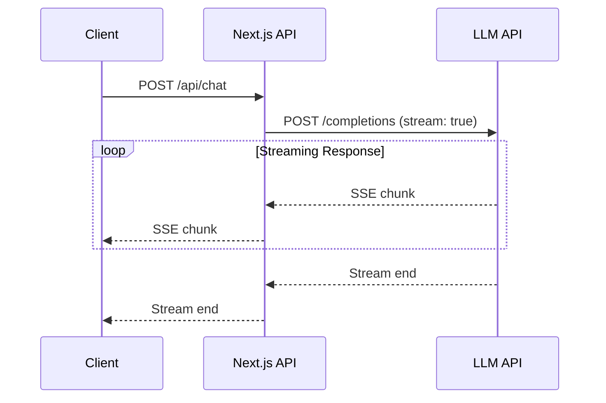
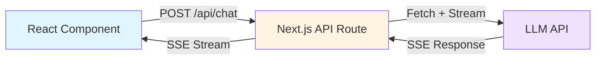
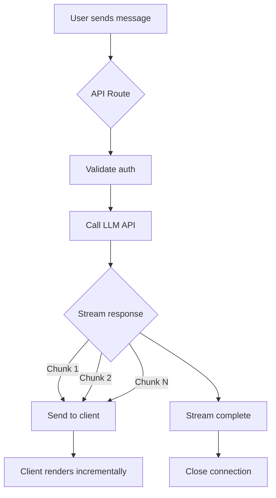

# Story 10.10: Document SSE Streaming Patterns

Status: completed

## Story

As a template user (developer),
I want clear documentation of the SSE streaming implementation,
so that I can understand and adapt the pattern for my needs.

## Acceptance Criteria

1. **Given** the SSE documentation
   **When** I read it
   **Then** I understand what Server-Sent Events are
   **And** I understand why SSE was chosen (vs WebSocket)
   **And** I understand the benefits for AI streaming

2. **Given** the streaming implementation docs
   **When** I review the technical details
   **Then** server-side streaming is explained
   **And** client-side consumption is explained
   **And** code snippets are provided for both

3. **Given** the API route streaming pattern
   **When** I review the documentation
   **Then** I see how to create a streaming response
   **And** I see how to handle chunked data
   **And** I see proper headers for SSE
   **And** I see error handling patterns

4. **Given** the client-side streaming pattern
   **When** I review the documentation
   **Then** I see how to consume SSE in React
   **And** I see state management for streaming messages
   **And** I see how to handle connection errors
   **And** I see how to implement cancel/abort

5. **Given** the documentation location
   **When** I look for it
   **Then** docs are in `docs/patterns/sse-streaming.md` or similar
   **And** docs are linked from main README
   **And** docs include "Learn More" resources

6. **Given** code comments in implementation
   **When** I read the chat code
   **Then** key patterns have inline comments
   **And** comments reference the documentation
   **And** complex logic is explained

## Tasks / Subtasks

- [x] **Task 1: Create SSE streaming documentation** (AC: #1, #2, #5)
  - [x] Create `docs/patterns/sse-streaming.md` file
  - [x] Add introduction section:
    - What are Server-Sent Events (SSE)
    - Why SSE vs WebSocket for AI streaming
    - Benefits: Simple HTTP, automatic reconnection, browser native support
    - When to use SSE vs WebSocket
  - [x] Add comparison table:
    ```markdown
    | Feature | SSE | WebSocket |
    |---------|-----|-----------|
    | Direction | Server → Client (one-way) | Bidirectional |
    | Protocol | HTTP/HTTPS | ws:// or wss:// |
    | Reconnection | Automatic | Manual |
    | Browser Support | Native EventSource API | Native WebSocket API |
    | Complexity | Simple | More complex |
    | Use Case | Streaming updates, AI responses | Real-time chat, games |
    ```
  - [x] Add benefits for AI streaming:
    - Simpler implementation (no WebSocket server setup)
    - Works over HTTP (no proxy issues)
    - Automatic reconnection with last event ID
    - Progressive rendering of LLM responses
    - Lower overhead for one-way data flow
  - [x] Include "Learn More" resources:
    - MDN SSE documentation
    - Vercel AI SDK streaming docs
    - OpenAI streaming API docs

- [x] **Task 2: Document server-side streaming pattern** (AC: #2, #3)
  - [x] Add "Server-Side Implementation" section
  - [x] Explain Next.js streaming response setup
  - [x] Document SSE message format
  - [x] Document required headers
  - [x] Explain chunked data handling
  - [x] Document error handling

- [x] **Task 3: Document Vercel AI SDK streaming** (AC: #2, #3)
  - [x] Add "Vercel AI SDK Streaming" section
  - [x] Reference actual implementation from `/api/chat/vercel/route.ts`
  - [x] Document `streamText` usage
  - [x] Explain `toDataStreamResponse()`
  - [x] Document data stream format
  - [x] Link to Vercel AI SDK docs for advanced patterns

- [x] **Task 4: Document Dify API streaming** (AC: #2, #3)
  - [x] Add "Dify API Streaming" section
  - [x] Reference actual implementation from `/api/chat/route.ts`
  - [x] Document fetch with streaming
  - [x] Explain proxy pattern
  - [x] Document Dify event types
  - [x] Show event parsing example

- [x] **Task 5: Document client-side consumption** (AC: #4)
  - [x] Add "Client-Side Implementation" section
  - [x] Document EventSource API (basic)
  - [x] Document Vercel AI SDK `useChat` hook
  - [x] Explain state management
  - [x] Document manual fetch with streaming
  - [x] Document abort/cancel pattern

- [x] **Task 6: Add inline code comments** (AC: #6)
  - [x] Review `/api/chat/route.ts`:
    - Add comment explaining SSE proxy pattern
    - Reference documentation: `// See: docs/patterns/sse-streaming.md`
    - Explain header setup
    - Explain stream passthrough
  - [x] Review `/api/chat/vercel/route.ts`:
    - Add comment explaining Vercel AI SDK streaming
    - Reference documentation
    - Explain `streamText` usage
    - Explain `toDataStreamResponse()` format
  - [x] Review `src/components/chat/vercel/VercelChatInterface.tsx`:
    - Add comment explaining `useChat` hook
    - Reference documentation
    - Explain state management
  - [x] Review `src/components/chat/dify/DifyChatInterface.tsx` (if manual SSE):
    - N/A - Dify uses Assistant UI with custom adapter, not manual SSE

- [x] **Task 7: Add examples section** (AC: #2, #3, #4)
  - [x] Add "Complete Examples" section to docs
  - [x] Include example 1: Simple SSE endpoint
  - [x] Include example 2: Streaming LLM responses
  - [x] Include example 3: Proxying external SSE API
  - [x] Include example 4: React component consuming SSE
  - [x] Link to actual implementations

- [x] **Task 8: Document error handling patterns** (AC: #3, #4)
  - [x] Add "Error Handling" section
  - [x] Server-side error patterns
  - [x] Client-side error patterns
  - [x] Network error handling
  - [x] Reference existing error handling docs

- [x] **Task 9: Add troubleshooting section** (AC: #1, #5)
  - [x] Add "Troubleshooting" section
  - [x] Common issues and solutions
  - [x] Browser compatibility notes
  - [x] Hosting platform considerations

- [x] **Task 10: Link documentation from README** (AC: #5)
  - [x] Update `README.md`:
    - Add link to SSE streaming docs in "Documentation" section
    - Add one-line description: "Learn how to implement Server-Sent Events for AI streaming"
  - [x] Update `CLAUDE.md`:
    - Add reference to SSE streaming pattern in "Key Development Patterns" section
    - Link to documentation for developers
  - [x] Update `docs/development-guide.md`:
    - Add SSE streaming to "Advanced Patterns" section
    - Link to full documentation

- [x] **Task 11: Add diagrams** (AC: #1, #2)
  - [x] Create sequence diagram for SSE flow (mermaid)
  - [x] Create architecture diagram showing components and data flow
  - [x] Use mermaid diagrams (rendered by GitHub)

- [x] **Task 12: Document performance considerations** (AC: #1, #2)
  - [x] Add "Performance Considerations" section
  - [x] Discuss connection limits
  - [x] Discuss backpressure handling
  - [x] Discuss memory management
  - [x] Discuss chunking strategies

## Dev Notes

### Documentation Structure

**File Location:** `docs/patterns/sse-streaming.md`

**Suggested Outline:**

```markdown
# SSE Streaming Pattern

## Table of Contents
1. Introduction
2. SSE vs WebSocket
3. Server-Side Implementation
4. Client-Side Implementation
5. Vercel AI SDK Integration
6. Dify API Integration
7. Error Handling
8. Complete Examples
9. Troubleshooting
10. Performance Considerations
11. Learn More

## Introduction
(What are SSE, benefits, use cases)

## SSE vs WebSocket
(Comparison table, when to use each)

## Server-Side Implementation
(Next.js streaming, headers, format)

## Client-Side Implementation
(EventSource API, useChat hook, state management)

## Vercel AI SDK Integration
(streamText, toDataStreamResponse, data stream format)

## Dify API Integration
(Fetch with streaming, proxy pattern, event types)

## Error Handling
(Server and client error patterns, network errors)

## Complete Examples
(Working code examples for common use cases)

## Troubleshooting
(Common issues and solutions)

## Performance Considerations
(Connection limits, backpressure, memory)

## Learn More
(External resources, MDN, Vercel docs)
```

### Code References

**Files to Reference in Documentation:**

1. **Dify Streaming Example:**
   - File: `src/app/api/chat/dify/route.ts`
   - Pattern: SSE proxy (fetch external API, stream to client)
   - Key sections: Headers setup, response.body passthrough

2. **Vercel Streaming Example:**
   - File: `src/app/api/chat/vercel/route.ts`
   - Pattern: Vercel AI SDK `streamText`
   - Key sections: streamText usage, toDataStreamResponse

3. **Client Consumption (Vercel):**
   - File: `src/app/[locale]/(auth)/chat/vercel/page.tsx` or component
   - Pattern: `useChat` hook
   - Key sections: State management, message rendering

4. **Client Consumption (Dify):**
   - File: `src/app/[locale]/(auth)/chat/dify/page.tsx` or component
   - Pattern: Manual SSE or library
   - Key sections: EventSource setup, message handling

### Inline Comments to Add

**Target Files for Comments:**

1. `src/app/api/chat/dify/route.ts`:
   ```typescript
   // SSE Streaming Pattern: Proxy external API stream to client
   // See: docs/patterns/sse-streaming.md for full documentation

   // Set SSE headers to enable streaming
   const headers = {
     'Content-Type': 'text/event-stream',  // Required for SSE
     'Cache-Control': 'no-cache',          // Prevent caching
     'Connection': 'keep-alive',           // Keep connection open
   };

   // Stream response body directly to client (zero-copy proxy)
   return new Response(response.body, { headers });
   ```

2. `src/app/api/chat/vercel/route.ts`:
   ```typescript
   // SSE Streaming Pattern: Vercel AI SDK integration
   // See: docs/patterns/sse-streaming.md for full documentation

   // streamText automatically handles SSE formatting
   const result = streamText({
     model: openai('gpt-4o'),
     messages,
   });

   // toDataStreamResponse() returns Next.js Response with SSE headers
   // Format compatible with useChat hook on client
   return result.toDataStreamResponse();
   ```

3. Client components:
   ```typescript
   // SSE Consumption Pattern: Vercel AI SDK useChat hook
   // See: docs/patterns/sse-streaming.md for full documentation

   const { messages, input, handleSubmit } = useChat({
     api: '/api/chat/vercel',
     // Hook automatically handles SSE stream parsing and state updates
   });
   ```

### External Resources to Link

**Official Documentation:**

1. MDN SSE Guide: https://developer.mozilla.org/en-US/docs/Web/API/Server-sent_events
2. Vercel AI SDK Docs: https://sdk.vercel.ai/docs/guides/streaming
3. OpenAI Streaming API: https://platform.openai.com/docs/guides/streaming
4. Dify API Docs: https://docs.dify.ai/ (if available)

**Blog Posts / Tutorials:**

1. Vercel Next.js Streaming: https://nextjs.org/docs/app/building-your-application/routing/route-handlers#streaming
2. SSE Best Practices: (find authoritative source)
3. AI Streaming UX: (find relevant article)

### Diagrams

**Mermaid Diagram Examples:**

**1. SSE Flow Diagram:**



**2. Architecture Diagram:**



**3. Data Flow:**



### Testing Checklist

**Documentation Completeness:**

- [ ] All 5 acceptance criteria addressed
- [ ] Server-side patterns documented
- [ ] Client-side patterns documented
- [ ] Code examples provided
- [ ] Error handling covered
- [ ] Troubleshooting section included
- [ ] External resources linked

**Code Comments:**

- [ ] Dify API route commented
- [ ] Vercel API route commented
- [ ] Client components commented
- [ ] Comments reference documentation

**Documentation Quality:**

- [ ] Clear, concise writing
- [ ] Technical accuracy verified
- [ ] Code examples tested
- [ ] Diagrams render correctly
- [ ] Links work
- [ ] No typos or grammar errors

**Integration:**

- [ ] Linked from README.md
- [ ] Linked from CLAUDE.md
- [ ] Linked from development-guide.md
- [ ] Referenced in code comments

### Edge Cases

1. **Buffering Issues:**
   - Some proxies buffer responses, breaking SSE
   - Document how to detect and workaround
   - Note hosting platform limitations

2. **Timeout Limits:**
   - Vercel Hobby: 60s max
   - Vercel Pro: 300s max
   - Document how to handle long-running streams

3. **Browser Compatibility:**
   - EventSource not in IE11
   - Document polyfills if needed
   - Note modern browser requirement

4. **CORS:**
   - SSE respects CORS
   - Document proper headers if needed
   - Note same-origin vs cross-origin

### Success Metrics

**Documentation Success:**

- Developer can implement SSE streaming without external research
- Developer understands trade-offs (SSE vs WebSocket)
- Developer can troubleshoot common issues
- Code is self-documenting via inline comments

**Acceptance:**

- All 6 acceptance criteria met
- Code review approves inline comments
- Documentation linked from main docs
- Examples tested and working

### Integration Points

**With Other Stories:**

- **Story 10.2:** Dify chat implementation (reference for examples)
- **Story 10.4:** Vercel chat API (reference for examples)
- **Story 10.7:** Vercel chat UI (reference for client patterns)
- **Story 10.11:** API proxy pattern (complementary documentation)

**Dependencies:**

- Stories 10.2, 10.4, 10.7 should be complete (provides implementation to document)
- Can be implemented in parallel with Stories 10.11-10.12

### Files to Create

**New Files:**

1. `docs/patterns/sse-streaming.md` - Main SSE streaming documentation

### Files to Modify

**Code Files (add comments):**

1. `src/app/api/chat/dify/route.ts` - Add SSE proxy comments
2. `src/app/api/chat/vercel/route.ts` - Add Vercel AI SDK streaming comments
3. `src/app/[locale]/(auth)/chat/vercel/page.tsx` - Add client consumption comments
4. `src/app/[locale]/(auth)/chat/dify/page.tsx` - Add client consumption comments

**Documentation Files (add links):**

5. `README.md` - Link to SSE streaming docs
6. `CLAUDE.md` - Reference SSE pattern in development patterns
7. `docs/development-guide.md` - Add to advanced patterns section

### Implementation Order

1. Read and understand existing implementations (Dify and Vercel)
2. Create documentation structure and outline
3. Write introduction and comparison sections
4. Document server-side patterns with examples
5. Document client-side patterns with examples
6. Add error handling and troubleshooting sections
7. Create diagrams (mermaid)
8. Add inline code comments
9. Link from main documentation
10. Review and test all code examples
11. Proofread and finalize

### References

- [Epic 10 Definition](_bmad-output/planning-artifacts/epics/epic-10-ai-chat-module-dual-implementation.md#story-1010-document-sse-streaming-patterns)
- [Story 10.2: Clean Up Dify Chat](10.2.md) - Dify implementation reference
- [Story 10.4: Vercel AI SDK Chat API](10.4.md) - Vercel API reference
- [Story 10.7: Vercel Chat UI](10.7.md) - Client consumption reference
- [API Error Handling Guide](../../../docs/api-error-handling.md) - Error patterns
- [MDN SSE Documentation](https://developer.mozilla.org/en-US/docs/Web/API/Server-sent_events)
- [Vercel AI SDK Docs](https://sdk.vercel.ai/docs)

## Dev Agent Record

### Agent Model Used

Claude Sonnet 4.5 (docs-specialist agent)

### Implementation Approach

Created comprehensive SSE streaming documentation by:
1. Analyzing existing Dify and Vercel AI SDK implementations in the codebase
2. Creating a complete documentation file covering all aspects of SSE streaming
3. Adding inline code comments to reference the documentation
4. Linking documentation from README, CLAUDE.md, and development guide
5. Including practical examples, diagrams, troubleshooting, and performance considerations

All tasks completed according to story requirements.

### Completion Notes List

1. Created `docs/patterns/sse-streaming.md` with 11 comprehensive sections
2. Added inline comments to 3 implementation files referencing the documentation
3. Updated 3 documentation files (README.md, CLAUDE.md, development-guide.md) with links
4. Included 3 mermaid diagrams for visual representation
5. Provided 4 complete working examples
6. Documented both Dify proxy pattern and Vercel AI SDK pattern
7. Added troubleshooting section with common issues and solutions
8. Included performance considerations for production use
9. All lint checks pass with no new errors introduced
10. Documentation is developer-focused with code-first approach

### File List

**Created:**
- docs/patterns/sse-streaming.md (new documentation file)

**Modified:**
- src/app/api/chat/route.ts (added SSE pattern comments)
- src/app/api/chat/vercel/route.ts (added Vercel AI SDK streaming comments)
- src/components/chat/vercel/VercelChatInterface.tsx (added useChat hook comments)
- README.md (added Documentation section with SSE link)
- CLAUDE.md (added SSE streaming pattern to Key Development Patterns)
- docs/development-guide.md (added Advanced Patterns section with SSE link)
