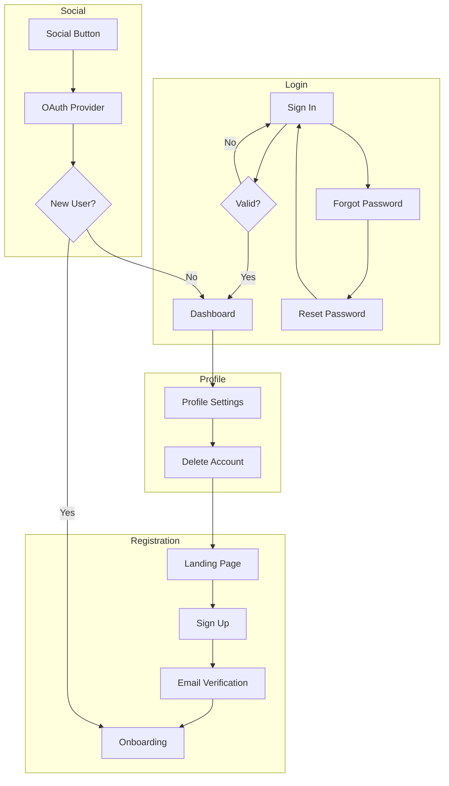
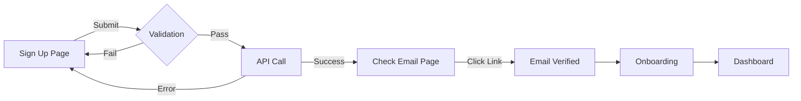
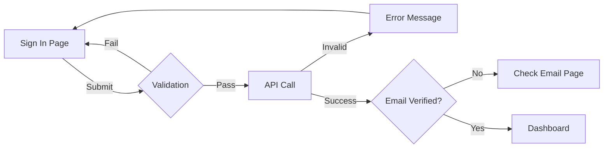
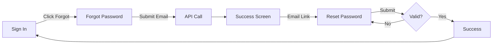
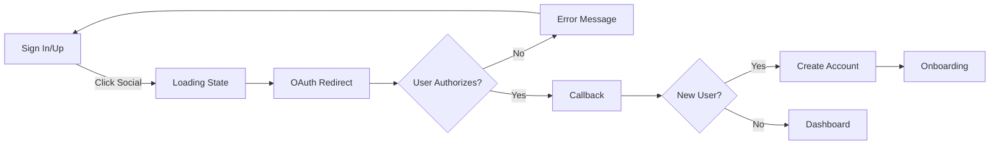
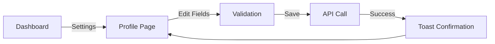
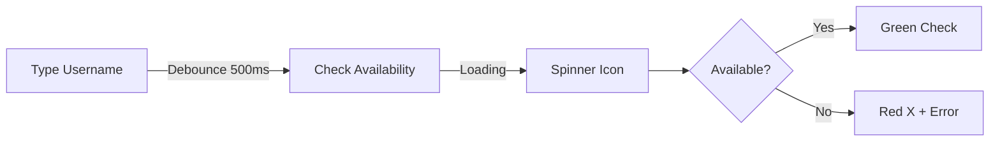
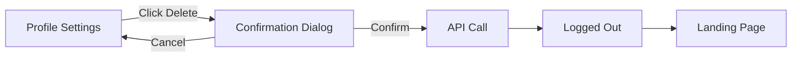

# User Journeys: Epic 2 - Complete Authentication Experience

**Date:** 2026-01-21

---

> **DEVELOPER NOTE: FLOWS ARE ALREADY IMPLEMENTED**
>
> These user journeys document the logic that **already exists as React code** in MagicPatterns.
> Each journey references its implementation source. Extract code using MagicPatterns MCP.
> See **[Component Strategy](epic-2-auth-component-strategy.md)** for extraction workflow.

---

## Journey Overview



---

## Journey 1: New User Registration

**Trigger:** User clicks "Sign Up" or "Get Started"
**Goal:** Create account and reach dashboard

### Flow



### Steps

| Step | Screen | User Action | System Response |
|------|--------|-------------|-----------------|
| 1 | Sign Up | Enters email + password | Real-time validation |
| 2 | Sign Up | Clicks "Create account" | Loading state, API call |
| 3 | Check Email | Views confirmation | Shows email, resend option |
| 4 | Check Email | (Optional) Clicks resend | Cooldown timer starts |
| 5 | Email | Clicks verification link | Redirects to app |
| 6 | Verified | Sees success message | Brief toast, redirect |
| 7 | Onboarding | Completes setup | Proceeds to dashboard |

### Error Handling

| Error | Display | Recovery |
|-------|---------|----------|
| Email already exists | "Email already registered" | Show "Sign in instead" link |
| Weak password | Inline validation message | Show requirements |
| Network error | Toast notification | "Try again" button |
| Expired link | "Link expired" screen | "Resend" button |

**Implementation Source:** Extract from [SignUpPage](https://www.magicpatterns.com/c/bxmfv74lgsrvfdrwaeqcrt) + [EmailVerificationPage](https://www.magicpatterns.com/c/3rhvxmnpjshhysr6p76xxd)

---

## Journey 2: Returning User Sign In

**Trigger:** User navigates to sign-in or protected route
**Goal:** Access dashboard quickly

### Flow



### Steps

| Step | Screen | User Action | System Response |
|------|--------|-------------|-----------------|
| 1 | Sign In | Enters email + password | — |
| 2 | Sign In | (Optional) Checks "Remember me" | Session extended |
| 3 | Sign In | Clicks "Sign In" | Loading state |
| 4a | Sign In | — (success) | Redirect to dashboard |
| 4b | Sign In | — (failure) | "Invalid email or password" |

### Remember Me Behavior

| Setting | Session Duration | Behavior |
|---------|------------------|----------|
| Unchecked | Browser session | Logged out on close |
| Checked | 30 days | Persists across sessions |

**Implementation Source:** Extract from [SignInPage](https://www.magicpatterns.com/c/uudzfo47fhnhhhzfhftkua)

---

## Journey 3: Password Reset

**Trigger:** User clicks "Forgot password?"
**Goal:** Regain account access

### Flow



### Steps

| Step | Screen | User Action | System Response |
|------|--------|-------------|-----------------|
| 1 | Sign In | Clicks "Forgot password?" | Navigate to forgot page |
| 2 | Forgot Password | Enters email | — |
| 3 | Forgot Password | Clicks "Send reset link" | Loading, then success |
| 4 | Success State | Views confirmation | Always shows success (security) |
| 5 | Email | Clicks reset link | Opens reset page |
| 6 | Reset Password | Enters new password | Real-time validation |
| 7 | Reset Password | Enters confirmation | Match validation |
| 8 | Reset Password | Clicks "Reset password" | Loading state |
| 9 | Success | Views confirmation | Redirect to sign in |

### Security Considerations

- **Same message for all emails:** "Check your email" shown whether email exists or not
- **Rate limiting:** Block after 5 requests per hour
- **Token expiry:** Reset links expire after 1 hour
- **One-time use:** Token invalidated after use

**Implementation Source:** Extract from [ForgotPasswordPage](https://www.magicpatterns.com/c/1xdwsbsectczdt1gpzyd5r) + [ResetPasswordPage](https://www.magicpatterns.com/c/mvjem6dcsdqzubf6kpavmg)

---

## Journey 4: Social Authentication

**Trigger:** User clicks Google or GitHub button
**Goal:** Quick sign in/up without password

### Flow



### Steps

| Step | Location | Action | Response |
|------|----------|--------|----------|
| 1 | App | Click social button | Button shows loading |
| 2 | OAuth | View provider consent | — |
| 3 | OAuth | Authorize/Deny | — |
| 4a | App | (Authorized) | Create/find account |
| 4b | App | (Denied/Error) | Show error, return to form |
| 5 | App | — | Redirect to dashboard or onboarding |

### Provider-Specific Notes

| Provider | Data Received | Usage |
|----------|---------------|-------|
| Google | Email, name, avatar | Pre-fill profile |
| GitHub | Email, username, avatar | Pre-fill profile |

**Implementation Source:** Extract social buttons from [SignInPage](https://www.magicpatterns.com/c/uudzfo47fhnhhhzfhftkua) (includes Google SVG icon)

---

## Journey 5: Profile Management

**Trigger:** User navigates to Profile Settings
**Goal:** Update personal information

### Flow



### Username Change Sub-flow



**Implementation Source:** Extract from [ProfileSettings](https://www.magicpatterns.com/c/4a3nbxktcjxj3w13dqwk9x) - `ProfileCard.tsx` has complete debounce logic

---

## Journey 6: Account Deletion

**Trigger:** User clicks "Delete my account"
**Goal:** Permanently remove account

### Flow



### Steps

| Step | Screen | User Action | System Response |
|------|--------|-------------|-----------------|
| 1 | Profile | Clicks "Delete my account" | Open confirmation dialog |
| 2 | Dialog | Reads warning | — |
| 3a | Dialog | Clicks "Cancel" | Close dialog |
| 3b | Dialog | Clicks "Delete permanently" | Loading state |
| 4 | — | — | Delete account, clear session |
| 5 | Landing | Views landing page | Logged out state |

### Confirmation Dialog Content

```
⚠️ Delete your account?

This will permanently delete:
• Your profile and settings
• All your data and history
• Access to your account

This action cannot be undone.

[Cancel]  [Delete permanently]
           ↑ red destructive button
```

**Implementation Source:** Extract from [ProfileSettings](https://www.magicpatterns.com/c/4a3nbxktcjxj3w13dqwk9x) - `DangerZone.tsx` has warning UI

---

## Edge Cases

### Email Verification

| Scenario | Handling |
|----------|----------|
| Expired link (>24h) | Show "Link expired" + resend option |
| Already verified | Redirect to dashboard with toast |
| Invalid token | Show "Invalid link" + resend option |
| Resend spam | 60s cooldown between resends |

### Password Reset

| Scenario | Handling |
|----------|----------|
| Expired link (>1h) | Show "Link expired" + request new |
| Already used | Show "Link already used" + request new |
| Invalid token | Show "Invalid link" + request new |

### Social Auth

| Scenario | Handling |
|----------|----------|
| Email mismatch | Prompt to link accounts |
| Provider error | Toast with "Try again" |
| User cancels | Return to form, no error |

### Profile

| Scenario | Handling |
|----------|----------|
| Username taken | Red indicator, block save |
| Network error | Toast with retry |
| Concurrent edit | Last save wins |

---

## State Transitions

### Auth State Machine

```
┌─────────────┐
│ Unauthenticated │
└──────┬──────┘
       │ login/register
       ▼
┌─────────────┐
│ Unverified  │◄────────┐
└──────┬──────┘         │
       │ verify email   │ register
       ▼                │
┌─────────────┐         │
│ Authenticated │───────┘
└──────┬──────┘   (new social user
       │            may skip verify)
       │ logout/delete
       ▼
┌─────────────┐
│ Unauthenticated │
└─────────────┘
```
