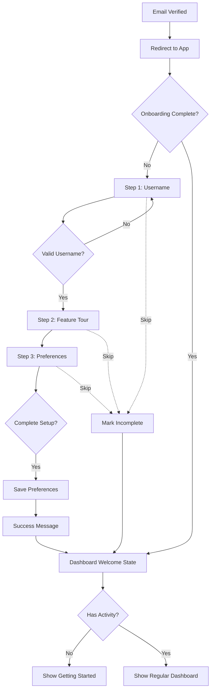

# Epic 3: User Onboarding & Welcome - User Journeys

## Primary Flow: New User Onboarding

**Trigger:** User verifies email and is redirected to the app for the first time
**Goal:** User sets up their profile and lands on a welcoming dashboard

### Flow Diagram



### Steps Detail

#### Step 1: Set Username (Required for completion)

**Screen:** Centered card with progress indicator (1/3)

**User Actions:**
1. Views welcome message
2. Enters desired username
3. Sees real-time availability feedback
4. Clicks "Continue" when valid

**System Behavior:**
- Debounce username check (500ms)
- Show spinner while checking
- Show green check if available, red X if taken
- Validate format: 3-20 chars, alphanumeric + underscores
- Save username to profile on continue

**Edge Cases:**
- Username becomes taken while typing → Show "taken" on submit attempt
- Network error during check → Show retry option

---

#### Step 2: Feature Tour (Informational)

**Screen:** Feature cards grid with progress indicator (2/3)

**User Actions:**
1. Views 3-4 feature highlights
2. Reads brief descriptions
3. Clicks "Continue" to proceed

**System Behavior:**
- No data input required
- Track that user viewed tour (analytics)
- Progress indicator shows Step 1 complete

**Features Shown:**
1. Lightning Fast - Performance focus
2. Secure by Default - Data protection
3. Smart Analytics - Progress tracking
4. AI Assistant - Chat capability

---

#### Step 3: Set Preferences

**Screen:** Preference toggles with progress indicator (3/3)

**User Actions:**
1. Toggle email notifications (default: ON)
2. Select language (default: English or browser locale)
3. Clicks "Complete Setup"

**System Behavior:**
- Pre-select sensible defaults
- Save preferences to user profile
- Show brief "You're all set!" success message
- Redirect to dashboard after 1-2 seconds

**Preferences:**
- Email notifications: Toggle (on/off)
- Language: Dropdown (English, Hindi, Bengali)

---

#### Dashboard Welcome State

**Screen:** Full dashboard with welcome section

**User Actions:**
1. Sees personalized greeting with username
2. Views "Getting Started" action cards
3. Clicks action to begin using app

**Getting Started Actions:**
1. Complete your profile → Edit Profile page
2. Explore features → Feature tour/help
3. Try the AI Assistant → Open chat

**System Behavior:**
- Show welcome state if no activity
- Track action completions
- Transition to regular dashboard after activity threshold

### Implementation Sources

| Step | Design Source | Primary File | Key Feature |
|------|---------------|--------------|-------------|
| 1. Username | [Step 1](https://www.magicpatterns.com/c/8dywtcpmne2a3vzohcewiu) | `OnboardingUsername.tsx` | UsernameInput with availability |
| 2. Feature Tour | [Step 2](https://www.magicpatterns.com/c/5imgbchlrja7tknmvtvken) | `OnboardingFeatureTour.tsx` | Feature cards grid |
| 3. Preferences | [Step 3](https://www.magicpatterns.com/c/1urfca8jgldest2yvquw6l) | `OnboardingPreferences.tsx` | Switch, Select, success state |
| 4. Dashboard | [Welcome](https://www.magicpatterns.com/c/n5z2nuwsc58wh1grcqascq) | `WelcomeDashboard.tsx` | ActionCards, greeting |

---

## Alternative Flows

### Skip Onboarding

**Trigger:** User clicks "Skip for now" at any step

**Flow:**
1. User clicks "Skip for now"
2. System marks `onboarding_completed: false`
3. System saves current step number
4. User redirected to dashboard
5. Dashboard shows subtle "Complete setup" prompt

**Resume Behavior:**
- On next login, check `onboarding_completed`
- If false, show "Continue setup" card on dashboard
- Clicking resumes at saved step
- Previously completed steps are not repeated

---

### Return User (Incomplete Onboarding)

**Trigger:** User logs in with incomplete onboarding

**Flow:**
1. User signs in
2. System checks `onboarding_completed === false`
3. Dashboard shows "Complete your setup" card
4. User can click to resume or dismiss
5. Dismissing hides prompt for session (shows again next login)

---

### Language Change Mid-Flow

**Trigger:** User wants to change language during onboarding

**Handling:**
- Language selection is in Step 3
- If user needs different language earlier, they can:
  - Complete onboarding, then change in settings
  - Skip to dashboard, change in settings, restart onboarding

---

## Edge Cases

| Scenario | Handling |
|----------|----------|
| Username taken after availability check | Re-check on submit, show error if taken |
| Network failure during save | Show retry button, don't lose entered data |
| Browser back button during wizard | Navigate to previous step, preserve entered data |
| Session expires mid-onboarding | On re-auth, resume from last saved step |
| User closes tab before completing | On return, resume from last saved step |
| Username with special characters | Client-side validation prevents submission |
| Very long username | Max 20 chars enforced client-side |

---

## Error States

### Network Errors

**Display:** Toast notification + inline retry option

```
"Couldn't save your username. Please try again."
[Retry] [Skip for now]
```

### Validation Errors

**Display:** Inline below field with red styling

```
Username: "ab"
Error: "Username must be at least 3 characters"
```

### Username Taken

**Display:** Inline indicator with suggestion

```
Username: "john" [X taken]
"Try: john123, john_dev, johnsmith"
```

### Server Error

**Display:** Full error state with retry

```
"Something went wrong"
"We couldn't complete your setup. Please try again."
[Retry] [Contact Support]
```

---

## State Management

### Onboarding State (stored in Supabase profiles)

```typescript
interface OnboardingState {
  onboarding_completed: boolean
  onboarding_step: number // 1, 2, or 3
  username: string | null
  language: 'en' | 'hi' | 'bn'
  email_notifications: boolean
}
```

### Client-Side State (during wizard)

```typescript
interface WizardState {
  currentStep: number
  username: string
  usernameAvailable: boolean | null
  language: string
  emailNotifications: boolean
  isSubmitting: boolean
  error: string | null
}
```

---

*Generated by designer-founder workflow on 2026-01-21*
