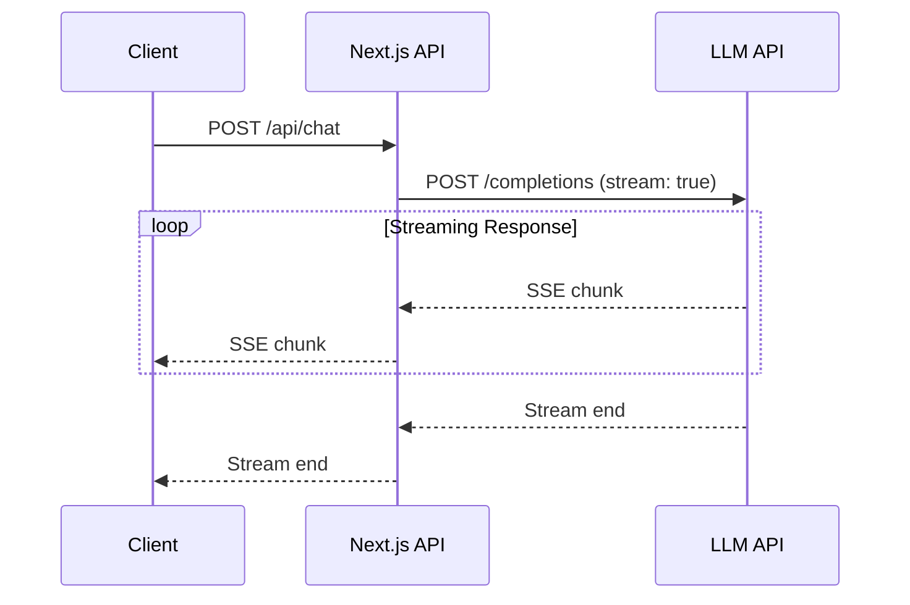
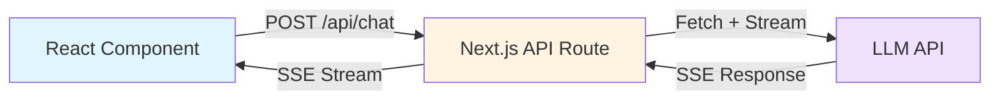
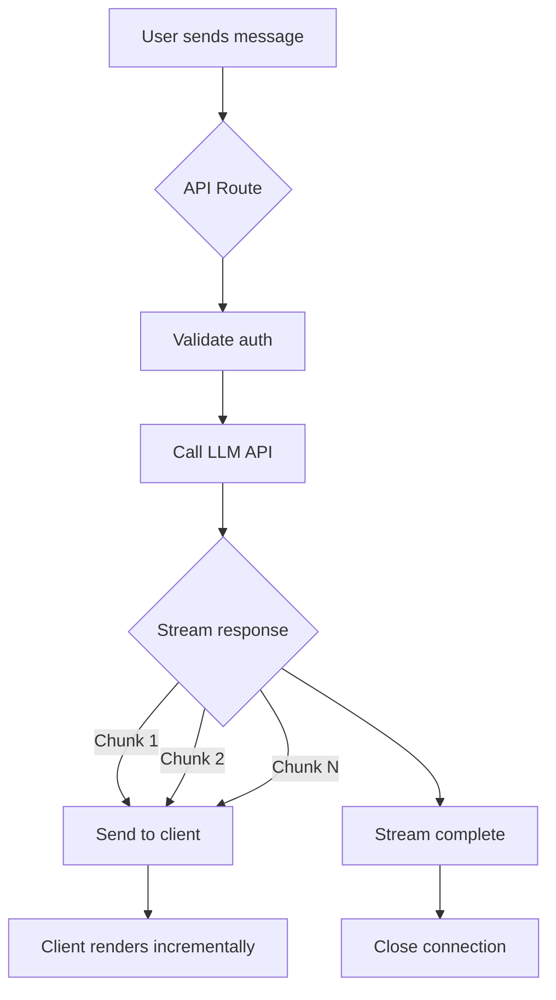

# SSE Streaming Pattern

## Table of Contents

1. [Introduction](#introduction)
2. [SSE vs WebSocket](#sse-vs-websocket)
3. [Server-Side Implementation](#server-side-implementation)
4. [Client-Side Implementation](#client-side-implementation)
5. [Vercel AI SDK Integration](#vercel-ai-sdk-integration)
6. [Dify API Integration](#dify-api-integration)
7. [Error Handling](#error-handling)
8. [Complete Examples](#complete-examples)
9. [Troubleshooting](#troubleshooting)
10. [Performance Considerations](#performance-considerations)
11. [Learn More](#learn-more)

## Introduction

Server-Sent Events (SSE) is a standard web technology that enables servers to push real-time updates to clients over HTTP. Unlike traditional request-response patterns, SSE maintains a persistent connection where the server can continuously send data to the client.

### What are Server-Sent Events?

SSE is a browser API that allows servers to stream events to web clients over a single, long-lived HTTP connection. The browser's built-in `EventSource` API automatically handles connection management, including:

- Opening and maintaining the connection
- Parsing the event stream format
- Automatic reconnection on connection loss
- Event buffering and replay using event IDs

### Why SSE for AI Streaming?

SSE is ideal for AI chat applications because:

1. **Simplicity**: Works over standard HTTP/HTTPS - no special protocols or server configurations needed
2. **Progressive Rendering**: Enables token-by-token streaming for natural, typewriter-like response display
3. **Built-in Reconnection**: Browser automatically reconnects if the connection drops, with support for resuming from the last event
4. **Lower Overhead**: One-way communication is simpler and more efficient than bidirectional protocols
5. **No Proxy Issues**: Works through standard HTTP infrastructure, CDNs, and reverse proxies
6. **Native Browser Support**: `EventSource` API available in all modern browsers without libraries

### When to Use SSE

**Use SSE when:**
- You need server-to-client streaming only (AI responses, notifications, live updates)
- You want simple implementation with minimal infrastructure changes
- You're working with existing HTTP-based APIs
- You need automatic reconnection and event replay

**Consider WebSocket when:**
- You need bidirectional, real-time communication (chat with typing indicators, multiplayer games)
- You need very low latency for rapid back-and-forth exchanges
- You're building a truly real-time collaborative application

## SSE vs WebSocket

| Feature | SSE | WebSocket |
|---------|-----|-----------|
| **Direction** | Server → Client (one-way) | Bidirectional |
| **Protocol** | HTTP/HTTPS | ws:// or wss:// |
| **Reconnection** | Automatic with event ID replay | Manual implementation required |
| **Browser API** | Native `EventSource` | Native `WebSocket` |
| **Complexity** | Simple (HTTP streaming) | More complex (custom protocol) |
| **Message Format** | Text-based (UTF-8) | Text or binary |
| **Proxy/Firewall** | Works with standard HTTP | May be blocked by some proxies |
| **Use Case** | Streaming updates, AI responses, notifications | Real-time chat, games, collaborative editing |
| **Overhead** | Lower (HTTP headers once) | Higher (WebSocket framing per message) |
| **Connection Limit** | Shares browser's 6 connections/domain | Separate connection pool |

### Benefits for AI Streaming

1. **Simpler Implementation**: No WebSocket server setup - works with existing Next.js API routes
2. **Works Everywhere**: Standard HTTP means it works through CDNs, load balancers, and corporate proxies
3. **Automatic Reconnection**: Built-in retry logic with event ID tracking for seamless recovery
4. **Progressive Rendering**: Stream tokens as they're generated for responsive UX
5. **Lower Infrastructure Overhead**: No need for separate WebSocket infrastructure or sticky sessions

## Server-Side Implementation

### Basic SSE Streaming in Next.js

Here's a minimal SSE endpoint in a Next.js API route:

```typescript
// Basic SSE endpoint
export async function POST(req: Request) {
  const encoder = new TextEncoder()

  const stream = new ReadableStream({
    async start(controller) {
      // Send SSE formatted data
      controller.enqueue(
        encoder.encode(`data: ${JSON.stringify({ message: 'Hello' })}\n\n`)
      )

      // Send another message
      controller.enqueue(
        encoder.encode(`data: ${JSON.stringify({ message: 'World' })}\n\n`)
      )

      // Close the stream
      controller.close()
    },
  })

  return new Response(stream, {
    headers: {
      'Content-Type': 'text/event-stream',
      'Cache-Control': 'no-cache',
      'Connection': 'keep-alive',
    },
  })
}
```

### SSE Message Format

SSE uses a simple text-based format with specific field types:

```
data: <content>\n\n           - Standard data message (required)
event: <type>\n                - Custom event type (optional)
id: <id>\n                     - Event ID for reconnection (optional)
retry: <ms>\n                  - Reconnection timeout in ms (optional)
```

**Examples:**

```
data: {"message": "Hello"}\n\n

event: custom-event\ndata: {"type": "notification"}\n\n

id: 123\ndata: {"resumable": true}\n\n

retry: 5000\n\n
```

**Important:** Each message must end with two newlines (`\n\n`) to signal the end of an event.

### Required Headers

Three headers are essential for SSE:

```typescript
{
  'Content-Type': 'text/event-stream',  // Required: Tells browser this is SSE
  'Cache-Control': 'no-cache',          // Prevent caching of stream
  'Connection': 'keep-alive',           // Keep connection open
}
```

### Chunked Data Handling

SSE streams data incrementally. Here's how to handle streaming from an external API:

```typescript
export async function POST(req: Request) {
  // Fetch from external API with streaming enabled
  const response = await fetch('https://api.example.com/stream', {
    method: 'POST',
    body: JSON.stringify({ query: 'Hello' }),
  })

  // Stream response body directly to client (zero-copy proxy)
  return new Response(response.body, {
    headers: {
      'Content-Type': 'text/event-stream',
      'Cache-Control': 'no-cache',
      'Connection': 'keep-alive',
    },
  })
}
```

For custom streaming logic:

```typescript
const stream = new ReadableStream({
  async start(controller) {
    try {
      for await (const chunk of dataSource) {
        // Encode and send each chunk
        const encoded = encoder.encode(
          `data: ${JSON.stringify(chunk)}\n\n`
        )
        controller.enqueue(encoded)

        // Flush to client immediately (no buffering)
        // Note: Next.js handles flushing automatically
      }
      controller.close()
    } catch (error) {
      controller.error(error)
    }
  },
})
```

### Error Handling

Send error events in SSE format and close the stream:

```typescript
const stream = new ReadableStream({
  async start(controller) {
    try {
      // ... streaming logic
    } catch (error) {
      // Send error event
      controller.enqueue(
        encoder.encode(
          `event: error\ndata: ${JSON.stringify({
            error: 'Failed to process request'
          })}\n\n`
        )
      )
      controller.close()
    }
  },
})
```

Handle client disconnection gracefully:

```typescript
const stream = new ReadableStream({
  async start(controller) {
    const abortController = new AbortController()

    // Detect client disconnection
    req.signal.addEventListener('abort', () => {
      abortController.abort()
      controller.close()
    })

    // Use abortController.signal for cancellable operations
  },
})
```

## Client-Side Implementation

### EventSource API (Basic)

The browser's built-in `EventSource` API provides simple SSE consumption:

```typescript
const eventSource = new EventSource('/api/chat')

eventSource.onmessage = (event) => {
  const data = JSON.parse(event.data)
  console.log('Received:', data)
}

eventSource.onerror = (error) => {
  console.error('SSE error:', error)
  eventSource.close()
}

// Clean up when done
eventSource.close()
```

**Limitations of EventSource:**
- Only supports GET requests (no POST with body)
- Cannot send custom headers (including Authorization)
- For POST requests with auth, use `fetch` with `ReadableStream` instead

### Manual Fetch with Streaming

For POST requests or custom headers, use `fetch` with stream reading:

```typescript
const response = await fetch('/api/chat', {
  method: 'POST',
  headers: {
    'Content-Type': 'application/json',
  },
  body: JSON.stringify({ message: 'Hello' }),
})

const reader = response.body?.getReader()
const decoder = new TextDecoder()

while (true) {
  const { done, value } = await reader.read()
  if (done) break

  const chunk = decoder.decode(value)

  // Parse SSE format: "data: {...}\n\n"
  const lines = chunk.split('\n')
  for (const line of lines) {
    if (line.startsWith('data: ')) {
      const data = JSON.parse(line.slice(6))
      console.log('Received:', data)
    }
  }
}
```

### Vercel AI SDK useChat Hook

The simplest approach for AI chat is Vercel's `useChat` hook:

```typescript
import { useChat } from 'ai/react'

function ChatComponent() {
  const { messages, input, handleInputChange, handleSubmit, isLoading } = useChat({
    api: '/api/chat/vercel',
    onError: (error) => console.error(error),
  })

  return (
    <div>
      {messages.map((message) => (
        <div key={message.id}>
          <strong>{message.role}:</strong> {message.content}
        </div>
      ))}

      <form onSubmit={handleSubmit}>
        <input value={input} onChange={handleInputChange} />
        <button type="submit" disabled={isLoading}>
          Send
        </button>
      </form>
    </div>
  )
}
```

### State Management

The `useChat` hook manages state automatically:

```typescript
const {
  messages,        // Array of all messages in conversation
  input,          // Current input value
  isLoading,      // True while streaming response
  error,          // Error object if request fails
  handleSubmit,   // Form submit handler
  append,         // Manually append a message
  reload,         // Retry last request
  stop,           // Cancel current stream
} = useChat({ api: '/api/chat/vercel' })
```

### Abort/Cancel Pattern

Cancel ongoing requests using `AbortController`:

```typescript
const abortController = new AbortController()

fetch('/api/chat', {
  method: 'POST',
  signal: abortController.signal,
  body: JSON.stringify({ message: 'Hello' }),
})

// Cancel request
abortController.abort()
```

With `useChat` hook:

```typescript
const { stop } = useChat({ api: '/api/chat' })

// Cancel current stream
stop()
```

## Vercel AI SDK Integration

### streamText Usage

The Vercel AI SDK provides `streamText` for streaming LLM responses:

```typescript
import { streamText } from 'ai'
import { openai } from '@ai-sdk/openai'

export async function POST(req: Request) {
  const { message } = await req.json()

  const result = streamText({
    model: openai('gpt-4o'),
    messages: [
      { role: 'user', content: message }
    ],
  })

  return result.toDataStreamResponse()
}
```

### toDataStreamResponse()

This method returns a Next.js `Response` with:
- Proper SSE headers set automatically
- Stream formatted for `useChat` hook consumption
- Token-by-token streaming from the LLM

```typescript
// result.toDataStreamResponse() returns:
new Response(stream, {
  headers: {
    'Content-Type': 'text/event-stream',
    'Cache-Control': 'no-cache, no-transform',
    'Connection': 'keep-alive',
  },
})
```

### Data Stream Format

Vercel AI SDK uses a custom SSE format optimized for `useChat`:

```
0:"Hello "               - Text chunk (type 0)
0:" world"               - Another text chunk
9:{"toolName":"..."}     - Tool call (type 9)
d:{"finishReason":"stop"} - Stream end metadata (type d)
```

This format is automatically parsed by the `useChat` hook - no manual parsing needed.

### Complete Example

See the reference implementation in this template:
- **API Route**: `src/app/api/chat/vercel/route.ts`
- **Client Component**: `src/components/chat/vercel/VercelChatInterface.tsx`

## Dify API Integration

### Fetch with Streaming

Proxy Dify API streams to the client:

```typescript
export async function POST(req: Request) {
  const { message, conversationId } = await req.json()

  const response = await fetch(process.env.DIFY_API_URL + '/chat-messages', {
    method: 'POST',
    headers: {
      'Content-Type': 'application/json',
      'Authorization': `Bearer ${process.env.DIFY_API_KEY}`,
    },
    body: JSON.stringify({
      query: message,
      user: userId,
      conversation_id: conversationId,
      response_mode: 'streaming',
    }),
  })

  // Return response stream directly (zero-copy proxy)
  return new Response(response.body, {
    headers: {
      'Content-Type': 'text/event-stream',
      'Cache-Control': 'no-cache',
      'Connection': 'keep-alive',
    },
  })
}
```

### Proxy Pattern

The proxy pattern keeps API keys server-side:

```
Client → Next.js API Route → External API (Dify)
       ← SSE Stream       ← SSE Stream
```

**Security Benefits:**
1. API key never exposed to client
2. Rate limiting applied server-side
3. Request validation before proxying
4. User authentication enforced

### Dify Event Types

Dify sends different event types in the SSE stream:

```typescript
// Message chunk
data: {"event":"message","answer":"Hello","conversation_id":"..."}

// Agent action
data: {"event":"agent_message","content":"Searching..."}

// Stream complete
data: {"event":"message_end","metadata":{...}}

// Error
data: {"event":"error","message":"Rate limit exceeded"}
```

### Event Parsing Example

```typescript
function parseSSEEvent(chunk: string): Record<string, any> | null {
  try {
    // SSE format: "data: {json}\n\n"
    const dataMatch = chunk.match(/data: (.+)/)
    if (!dataMatch?.[1]) return null

    const jsonStr = dataMatch[1].trim()
    return JSON.parse(jsonStr)
  } catch {
    return null
  }
}

// Usage in transform stream
const transformStream = new TransformStream({
  transform(chunk, controller) {
    const text = decoder.decode(chunk, { stream: true })
    const event = parseSSEEvent(text)

    if (event) {
      console.log('Event type:', event.event)
      console.log('Data:', event)
    }

    // Pass through to client
    controller.enqueue(chunk)
  },
})
```

### Complete Example

See the reference implementation:
- **API Route**: `src/app/api/chat/route.ts` (Dify proxy)
- **Client Library**: `src/libs/dify/client.ts`
- **Client Component**: `src/app/[locale]/(auth)/chat/dify/page.tsx`

## Error Handling

### Server-Side Error Patterns

Send error events and close the stream:

```typescript
const stream = new ReadableStream({
  async start(controller) {
    try {
      // ... streaming logic
    } catch (error) {
      // Send error event in SSE format
      controller.enqueue(
        encoder.encode(
          `event: error\ndata: ${JSON.stringify({
            error: error.message || 'Failed to process request',
            code: 'INTERNAL_ERROR'
          })}\n\n`
        )
      )
      controller.close()
    }
  },
})
```

Log errors for monitoring (see `docs/api-error-handling.md`):

```typescript
import { logApiError } from '@/libs/api/errors'

try {
  // ... streaming logic
} catch (error) {
  logApiError(error, {
    endpoint: '/api/chat',
    method: 'POST',
    errorCode: 'STREAM_ERROR',
  })
  throw error
}
```

### Client-Side Error Patterns

Detect connection errors with `EventSource`:

```typescript
const eventSource = new EventSource('/api/chat')

eventSource.addEventListener('error', (event) => {
  console.error('Connection error')
  setError('Connection lost. Retrying...')
  // EventSource automatically retries
})

eventSource.addEventListener('error', (event) => {
  const data = JSON.parse(event.data)
  setError(data.error)
  eventSource.close()
})
```

With `useChat` hook:

```typescript
const { error, reload } = useChat({
  api: '/api/chat',
  onError: (error) => {
    console.error('Chat error:', error)
    toast.error(error.message)
  },
})

// Retry on error
if (error) {
  reload()
}
```

### Network Error Handling

**Automatic Reconnection (EventSource):**
```typescript
const eventSource = new EventSource('/api/chat')

// Browser automatically reconnects on connection loss
// Uses exponential backoff (default retry interval)
// Sends Last-Event-ID header to resume from last event
```

**Manual Reconnection (fetch):**
```typescript
async function connectWithRetry(maxRetries = 3) {
  for (let i = 0; i < maxRetries; i++) {
    try {
      const response = await fetch('/api/chat', { method: 'POST' })
      return response
    } catch (error) {
      if (i === maxRetries - 1) throw error
      await new Promise(resolve => setTimeout(resolve, 1000 * (i + 1)))
    }
  }
}
```

**Timeout Handling:**
```typescript
const controller = new AbortController()
const timeoutId = setTimeout(() => controller.abort(), 30000) // 30s timeout

try {
  const response = await fetch('/api/chat', {
    signal: controller.signal,
  })
} catch (error) {
  if (error.name === 'AbortError') {
    console.error('Request timeout')
  }
} finally {
  clearTimeout(timeoutId)
}
```

## Complete Examples

### Example 1: Simple SSE Endpoint

```typescript
// app/api/simple-sse/route.ts
export async function GET() {
  const encoder = new TextEncoder()

  const stream = new ReadableStream({
    async start(controller) {
      // Send countdown
      for (let i = 5; i >= 0; i--) {
        controller.enqueue(
          encoder.encode(`data: ${JSON.stringify({ count: i })}\n\n`)
        )
        await new Promise(resolve => setTimeout(resolve, 1000))
      }

      // Send completion
      controller.enqueue(
        encoder.encode(`data: ${JSON.stringify({ done: true })}\n\n`)
      )

      controller.close()
    },
  })

  return new Response(stream, {
    headers: {
      'Content-Type': 'text/event-stream',
      'Cache-Control': 'no-cache',
      'Connection': 'keep-alive',
    },
  })
}
```

### Example 2: Streaming LLM Responses

```typescript
// app/api/chat/ai/route.ts
import { streamText } from 'ai'
import { openai } from '@ai-sdk/openai'

export async function POST(req: Request) {
  const { message } = await req.json()

  try {
    const result = streamText({
      model: openai('gpt-4o'),
      messages: [
        { role: 'system', content: 'You are a helpful assistant.' },
        { role: 'user', content: message }
      ],
      temperature: 0.7,
      maxTokens: 1000,
    })

    return result.toDataStreamResponse()
  } catch (error) {
    return new Response(
      JSON.stringify({ error: 'Failed to generate response' }),
      { status: 500, headers: { 'Content-Type': 'application/json' } }
    )
  }
}
```

### Example 3: Proxying External SSE API

```typescript
// app/api/proxy/route.ts
export async function POST(req: Request) {
  const { query } = await req.json()

  try {
    // Fetch from external API
    const response = await fetch('https://external-api.com/stream', {
      method: 'POST',
      headers: {
        'Authorization': `Bearer ${process.env.EXTERNAL_API_KEY}`,
        'Content-Type': 'application/json',
      },
      body: JSON.stringify({ query }),
    })

    if (!response.ok) {
      throw new Error(`API error: ${response.status}`)
    }

    // Stream to client (zero-copy proxy)
    return new Response(response.body, {
      headers: {
        'Content-Type': 'text/event-stream',
        'Cache-Control': 'no-cache',
        'Connection': 'keep-alive',
      },
    })
  } catch (error) {
    return new Response(
      JSON.stringify({ error: 'Failed to connect to API' }),
      { status: 500, headers: { 'Content-Type': 'application/json' } }
    )
  }
}
```

### Example 4: React Component Consuming SSE

```typescript
// Using useChat hook
'use client'

import { useChat } from 'ai/react'

export function ChatComponent() {
  const { messages, input, handleInputChange, handleSubmit, isLoading, error } = useChat({
    api: '/api/chat/ai',
  })

  return (
    <div>
      <div>
        {messages.map((message) => (
          <div key={message.id}>
            <strong>{message.role}:</strong> {message.content}
          </div>
        ))}
        {isLoading && <div>AI is thinking...</div>}
        {error && <div>Error: {error.message}</div>}
      </div>

      <form onSubmit={handleSubmit}>
        <input
          value={input}
          onChange={handleInputChange}
          disabled={isLoading}
        />
        <button type="submit" disabled={isLoading}>
          Send
        </button>
      </form>
    </div>
  )
}
```

### Reference Implementations

This template includes two complete SSE implementations:

**Dify Implementation:**
- API Route: `src/app/api/chat/route.ts`
- Client: `src/app/[locale]/(auth)/chat/dify/page.tsx`
- Pattern: SSE proxy (fetch external API, stream to client)

**Vercel AI SDK Implementation:**
- API Route: `src/app/api/chat/vercel/route.ts`
- Client: `src/components/chat/vercel/VercelChatInterface.tsx`
- Pattern: Vercel AI SDK `streamText` with `useChat` hook

## Troubleshooting

### Stream Doesn't Start

**Symptoms:** No events received, connection hangs

**Possible Causes & Solutions:**

1. **Missing or incorrect Content-Type header**
   ```typescript
   // ✗ Wrong
   headers: { 'Content-Type': 'application/json' }

   // ✓ Correct
   headers: { 'Content-Type': 'text/event-stream' }
   ```

2. **CORS issues**
   ```typescript
   // Add CORS headers if needed
   headers: {
     'Content-Type': 'text/event-stream',
     'Access-Control-Allow-Origin': '*',
   }
   ```

3. **Response buffering by proxy/middleware**
   ```typescript
   // Disable buffering in Next.js
   export const dynamic = 'force-dynamic'
   ```

### Client Doesn't Receive Events

**Symptoms:** Stream starts but no messages appear

**Possible Causes & Solutions:**

1. **Incorrect SSE format (missing newlines)**
   ```typescript
   // ✗ Wrong
   encoder.encode(`data: ${JSON.stringify(data)}`)

   // ✓ Correct
   encoder.encode(`data: ${JSON.stringify(data)}\n\n`)
   ```

2. **JSON parsing errors**
   ```typescript
   // Add error handling
   try {
     const data = JSON.parse(event.data)
   } catch (error) {
     console.error('Failed to parse SSE event:', error)
   }
   ```

3. **Event listener not attached**
   ```typescript
   // For default messages
   eventSource.onmessage = handler

   // For custom event types
   eventSource.addEventListener('custom-event', handler)
   ```

### Stream Cuts Off Early

**Symptoms:** Stream stops before completion

**Possible Causes & Solutions:**

1. **Timeout limits exceeded**
   ```typescript
   // Vercel Hobby: 60s max, Pro: 300s max
   // Split long operations or upgrade plan
   ```

2. **Server keep-alive timeout**
   ```typescript
   // Send periodic heartbeat comments
   setInterval(() => {
     controller.enqueue(encoder.encode(': ping\n\n'))
   }, 15000)
   ```

3. **Client-side abort**
   ```typescript
   // Ensure AbortController not triggered prematurely
   // Check for component unmount cleanup
   ```

### Memory Leaks

**Symptoms:** Increasing memory usage, browser slowdown

**Solutions:**

1. **Close EventSource when component unmounts**
   ```typescript
   useEffect(() => {
     const eventSource = new EventSource('/api/chat')

     return () => {
       eventSource.close()
     }
   }, [])
   ```

2. **Abort fetch requests properly**
   ```typescript
   useEffect(() => {
     const controller = new AbortController()

     fetch('/api/chat', { signal: controller.signal })

     return () => {
       controller.abort()
     }
   }, [])
   ```

3. **Remove event listeners**
   ```typescript
   useEffect(() => {
     const handler = (event) => { /* ... */ }
     eventSource.addEventListener('message', handler)

     return () => {
       eventSource.removeEventListener('message', handler)
     }
   }, [])
   ```

### Browser Compatibility

**EventSource Support:**
- ✓ All modern browsers (Chrome, Firefox, Safari, Edge)
- ✗ Internet Explorer (not supported)

**Fallback for older browsers:**
```typescript
if (typeof EventSource === 'undefined') {
  // Use polyfill or fall back to polling
  console.warn('EventSource not supported, using fallback')
}
```

### Hosting Platform Considerations

**Vercel:**
- Hobby Plan: 60 second timeout
- Pro Plan: 300 second timeout
- Edge Runtime: Streaming supported
- Solution: Keep responses under timeout or use long-running background jobs

**Netlify:**
- Edge Functions: Streaming supported
- Function timeout: 10 seconds (background: 15 minutes)
- Solution: Use Edge Functions for SSE

**AWS API Gateway:**
- HTTP API: Streaming not supported
- Lambda Function URLs: Streaming supported
- Solution: Use Lambda Function URLs or ALB

## Performance Considerations

### Connection Limits

Browsers limit concurrent connections per domain (typically 6):

```
Browser → example.com
├─ Connection 1: SSE stream (long-lived)
├─ Connection 2: API request
├─ Connection 3: API request
├─ Connection 4: Image
├─ Connection 5: Script
└─ Connection 6: CSS
```

**Impact:** One SSE connection reduces available connections for other requests.

**Solutions:**
1. Use HTTP/2 (multiplexing eliminates per-connection limits)
2. Use CDN for static assets (different domain)
3. Close SSE connections when not actively streaming

### Backpressure Handling

When client is slower than server, data buffers in memory:

```typescript
const stream = new ReadableStream({
  async start(controller) {
    for await (const chunk of dataSource) {
      // Check if buffer is full
      if (controller.desiredSize !== null && controller.desiredSize <= 0) {
        // Wait for client to catch up
        await new Promise(resolve => setTimeout(resolve, 100))
      }

      controller.enqueue(encoder.encode(`data: ${chunk}\n\n`))
    }
  },
})
```

**Close stream for very slow clients:**
```typescript
if (controller.desiredSize !== null && controller.desiredSize < -10000) {
  console.error('Client too slow, closing stream')
  controller.close()
  return
}
```

### Memory Management

**Clean up resources properly:**

```typescript
// Server-side
const stream = new ReadableStream({
  async start(controller) {
    const cleanup = () => {
      // Close database connections
      // Cancel pending operations
      // Release resources
    }

    try {
      // ... streaming logic
    } finally {
      cleanup()
    }
  },
})

// Client-side
useEffect(() => {
  const eventSource = new EventSource('/api/chat')

  return () => {
    eventSource.close() // Cleanup on unmount
  }
}, [])
```

**Avoid memory leaks in long-lived streams:**
```typescript
// ✗ Bad: Accumulates all chunks in memory
let allChunks = ''
eventSource.onmessage = (event) => {
  allChunks += event.data // Memory leak!
}

// ✓ Good: Process chunks immediately
eventSource.onmessage = (event) => {
  processChunk(event.data) // No accumulation
}
```

### Chunking Strategies

**Flush frequency trade-offs:**

```typescript
// High frequency (every token) - Best responsiveness, higher overhead
controller.enqueue(encoder.encode(`data: ${token}\n\n`))

// Medium frequency (every 3-5 tokens) - Balanced
let buffer = ''
for (const token of tokens) {
  buffer += token
  if (buffer.length >= 5) {
    controller.enqueue(encoder.encode(`data: ${buffer}\n\n`))
    buffer = ''
  }
}

// Low frequency (complete sentences) - Lower overhead, delayed updates
```

**Optimal chunk size:**
- **Small chunks (<100 bytes)**: More overhead, better responsiveness
- **Medium chunks (100-1000 bytes)**: Balanced for most use cases
- **Large chunks (>1000 bytes)**: Less overhead, may feel sluggish

**Recommendation:** For AI chat, stream every 1-3 tokens for natural typing effect.

### Monitoring Performance

Track key metrics:

```typescript
const startTime = Date.now()

const stream = new ReadableStream({
  async start(controller) {
    let chunkCount = 0
    let bytesSent = 0

    for await (const chunk of dataSource) {
      const data = encoder.encode(`data: ${chunk}\n\n`)
      controller.enqueue(data)

      chunkCount++
      bytesSent += data.byteLength
    }

    const duration = Date.now() - startTime
    console.log({
      duration,
      chunkCount,
      bytesSent,
      avgChunkSize: bytesSent / chunkCount,
    })

    controller.close()
  },
})
```

## Learn More

### Official Documentation

- **MDN SSE Guide**: [https://developer.mozilla.org/en-US/docs/Web/API/Server-sent_events](https://developer.mozilla.org/en-US/docs/Web/API/Server-sent_events)
- **Vercel AI SDK**: [https://sdk.vercel.ai/docs/guides/streaming](https://sdk.vercel.ai/docs/guides/streaming)
- **Next.js Streaming**: [https://nextjs.org/docs/app/building-your-application/routing/route-handlers#streaming](https://nextjs.org/docs/app/building-your-application/routing/route-handlers#streaming)
- **OpenAI Streaming API**: [https://platform.openai.com/docs/guides/streaming](https://platform.openai.com/docs/guides/streaming)

### Related Documentation

- **API Error Handling**: [docs/api-error-handling.md](../api-error-handling.md)
- **Error Handling Guide**: [docs/error-handling-guide.md](../error-handling-guide.md)
- **Development Guide**: [docs/development-guide.md](../development-guide.md)

### Diagrams

#### SSE Flow Sequence



#### Architecture Overview



#### Data Flow


